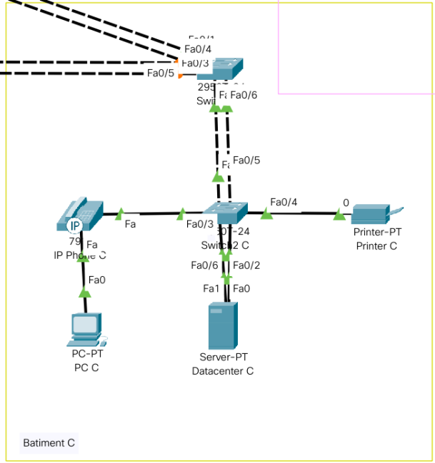

# Documentation TP2

### William Gillot - Louis Maury

## Sommaire

- [Dépôt Git](#depot-git)
- [Architecture Globale](#architecture-globale)
    - [Bâtiment A](#batiment-a)
    - [Bâtiment B](#batiment-b)
    - [Bâtiment C](#batiment-c)
    - [Bâtiment D](#batiment-d)
- [Détails](#details)
    - [Ajouts](#ajouts)
    - [Vlan](#vlan)
    - [A Venir](#a-venir)
- [Commandes](#commandes)
    - [Switch](#switch)
        - [Vlan](#vlan)
        - [Trunk (Exemple)](#trunk-exemple)
        - [Access (Exemple)](#access-exemple)
        - [VTP Liste Commande](#vtp-liste-commande)
    - [Routeur](#routeur)
        - [Routage Inter-Vlan](#routage-inter-vlan)

## Dépôt Git
[Lien de notre dépôt git](https://git)

## Architecture Globale


Batiment | Equipement | VLAN | IP | Gateway
--- | --- | --- | --- | ---
A | Datacenter A | 10 | `10.10.0.10` | `10.10.0.254`
B | Datacenter B | 10 | `10.10.0.11` | `10.10.0.254`
B | PC1 B | 20 | `10.20.0.21` | `10.20.0.254`
B | PC2 B | 20 | `10.20.0.22` | `10.20.0.254`
B | Printer B | 30 | `10.30.0.31` | `10.30.0.254`
C | Datacenter C | 10 | `10.10.0.12` | `10.10.0.254`
C | PC C | 20 | `10.20.0.23` | `10.20.0.254`
C | Printer C | 30 | `10.30.0.32` | `10.30.0.254`
D | Datacenter D | 10 | `10.10.0.13` | `10.10.0.254`
D | PC 1 D | 20 | `10.20.0.33` | `10.20.0.254`
D | PC 2 D | 20 | `10.20.0.34` | `10.20.0.254`
D | Printer D | 30 | `10.30.0.33` | `10.30.0.254`

### Bâtiment A


### Bâtiment B


### Bâtiment C


### Bâtiment D


## Détails

### Ajouts
Comme demandé dans l'énnoncé, nous avons ajouté un datacenter dans chaques bâtiments (B, C, D) ainsi que des imprimantes et une passerelle internet.

Pour le nouveau bâtiment (D), nous avons pris la décision de mettre 2 fois 25 téléphones reliés aux PC (50 en tout), un Datacenter et une imprimante comme dit précèdemment ainsi qu'un routeur pour faire la liaison par Internet avec le reste de l'infra.

Le spanning tree a été mis en place sur les switchs 1.

### Vlan

Nous avons décider de créer 3 Vlan différents:

Les datacenter pour qu'ils puissent communiquer entre eux.

Les Pc pour la même raison, nous aurions pu les mettres dans des Vlan celon les bâtiments mais nous avons préféré centralisé notre archi.

Les imprimantes dans un Vlan à part pour des questions de sécurité.

### A Venir

Mise en place de pare feu (Fortinet) pour sécuriser l'archi au niveau des Vlans.

## Commandes

### Switch

#### Vlan
```
enable 
conf t
vlan 10
name vlan_server
ex
vlan 20
name vlan_pc
ex
vlan 30
name vlan_printer
ex

interface vlan 10
ip address 10.10.0.1 255.255.255.0
no shut
ex
ip default-gateway 10.10.0.254
interface vlan 20
ip address 10.20.0.1 255.255.255.0
no shut
ex
ip default-gateway 10.20.0.254
interface vlan 30
ip address 10.30.0.1 255.255.255.0
no shut
ex
ip default-gateway 10.30.0.254
```

#### Trunk Exemple
```
interface fastEthernet 0/2
switchport mode trunk
switchport trunk allowed vlan 1,10,20,30
no shut
ex
```

#### Access Exemple
```
interface fastEthernet 0/3
switchport mode access 
no shut
ex
```

#### VTP Liste Commande
Switch server (Un seul autorisé)
```
vtp mode server
```
Switch client
```
vtp mode client
```
Switch liaison
```
vtp mode transparent
```
VTP désactivé
```
vtp mode off
```
Mise en place du domain VTP avec mdp
```
vtp domain mydomain
vtp password mypassword
```

### Routeur

#### Routage Inter-Vlan
```
# Routage inter-vlan coté Switch
interface gigabitEthernet 0/0
no shutdown 
ex

# Vlan 10
interface gigabitEthernet 0/0.10
encapsulation dot1Q 10
ip address 10.10.0.254 255.255.255.0
no shutdown 
ex

# Vlan 20
interface gigabitEthernet 0/0.20
encapsulation dot1Q 20
ip address 10.20.0.254 255.255.255.0
no shut
ex

# Vlan 30
interface gigabitEthernet 0/0.30
encapsulation dot1Q 30
ip address 10.30.0.254 255.255.255.0
no shutdown 
ex

# Vlan 10 coté datacenter
interface gigabitEthernet 0/1
no shutdown
ex
```
 
