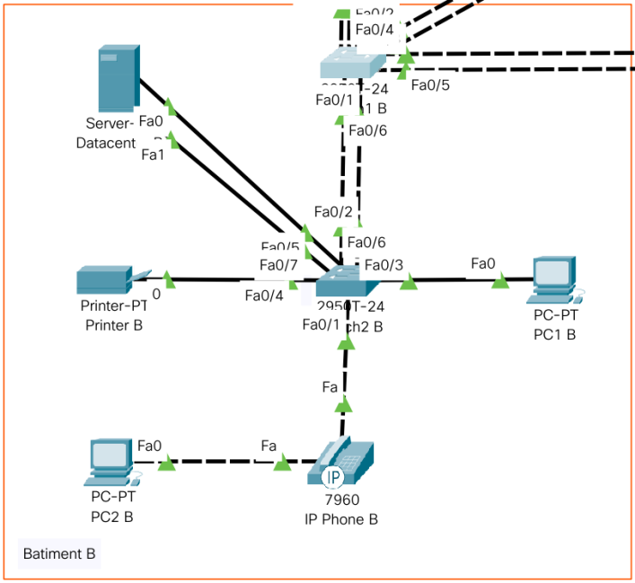
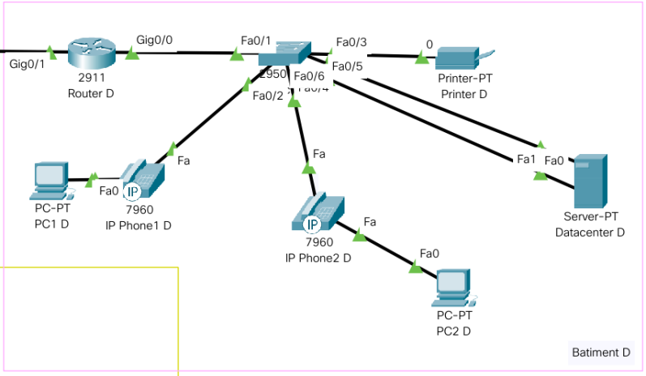

# `Documentation TP2`

### William Gillot - Louis Maury

## `Sommaire`

- [`Sommaire`](#sommaire)
  - [`Dépôt Git`](#dépôt-git)
  - [`Architecture Globale`](#architecture-globale)
    - [`Bâtiment A`](#bâtiment-a)
    - [`Bâtiment B`](#bâtiment-b)
    - [`Bâtiment B-Bis`](#bâtiment-b-bis)
    - [`Bâtiment C`](#bâtiment-c)
    - [`Bâtiment D`](#bâtiment-d)
  - [`Détails`](#détails)
    - [`Ajouts`](#ajouts)
    - [`Vlan`](#vlan)
    - [`Spanning Tree`](#spanning-tree)
    - [`LACP LAG`](#lacp-lag)
  - [`Commandes`](#commandes)
    - [`Switch`](#switch)
      - [`Vlan`](#vlan-1)
      - [`Trunk Exemple`](#trunk-exemple)
      - [`Access Exemple`](#access-exemple)
      - [`VTP Liste Commande`](#vtp-liste-commande)
      - [`STP Liste Commande`](#stp-liste-commande)
      - [`Agregation de liens Liste Commande`](#agregation-de-liens-liste-commande)
    - [`Routeur`](#routeur)
      - [`Routage Inter-Vlan`](#routage-inter-vlan)

## `Dépôt Git`
[Lien de notre dépôt git](https://git)

## `Architecture Globale`


| Batiment | Equipement       | VLAN | IP           | Gateway       |
| -------- | ---------------- | ---- | ------------ | ------------- |
| A        | Datacenter A     | 10   | `10.10.0.10` | `10.10.0.254` |
| A        | Server-Printer A | 40   | `10.40.0.10` | `10.40.0.254` |
| B        | Datacenter B     | 10   | `10.10.0.20` | `10.10.0.254` |
| B        | PC1 B            | 20   | `10.20.0.20` | `10.20.0.254` |
| B        | PC2 B            | 20   | `10.20.0.21` | `10.20.0.254` |
| B        | Phone1 B         | 50   | `10.50.0.20` | `10.50.0.254` |
| B        | Phone2 B         | 50   | `10.50.0.21` | `10.50.0.254` |
| B        | Printer B        | 30   | `10.30.0.20` | `10.30.0.254` |
| B-Bis    | Datacenter B-BIS | 10   | `10.10.0.50` | `10.10.0.254` |
| B-Bis    | PC1 B-Bis        | 20   | `10.20.0.50` | `10.20.0.254` |
| B-Bis    | PC2 B-Bis        | 20   | `10.20.0.51` | `10.20.0.254` |
| B-Bis    | PC3 B-Bis        | 20   | `10.20.0.52` | `10.20.0.254` |
| B-Bis    | PC4 B-Bis        | 20   | `10.20.0.53` | `10.20.0.254` |
| B-Bis    | Phone1 B-Bis     | 50   | `10.50.0.50` | `10.50.0.254` |
| B-Bis    | Phone2 B-Bis     | 50   | `10.50.0.51` | `10.50.0.254` |
| B-Bis    | Phone3 B-Bis     | 50   | `10.50.0.52` | `10.50.0.254` |
| B-Bis    | Phone4 B-Bis     | 50   | `10.50.0.53` | `10.50.0.254` |
| B-Bis    | Printer B-Bis    | 30   | `10.31.0.50` | `10.30.0.254` |
| C        | Datacenter C     | 10   | `10.10.0.30` | `10.10.0.254` |
| C        | PC C             | 20   | `10.20.0.30` | `10.20.0.254` |
| C        | Phone C          | 50   | `10.50.0.30` | `10.50.0.254` |
| C        | Printer C        | 30   | `10.30.0.30` | `10.30.0.254` |
| D        | Datacenter D     | 10   | `10.10.0.40` | `10.10.0.254` |
| D        | PC1  D           | 20   | `10.20.0.40` | `10.20.0.254` |
| D        | PC2  D           | 20   | `10.20.0.41` | `10.20.0.254` |
| D        | Phone1  D        | 50   | `10.50.0.40` | `10.20.0.254` |
| D        | Phone2  D        | 50   | `10.50.0.41` | `10.20.0.254` |
| D        | Printer D        | 30   | `10.30.0.40` | `10.30.0.254` |

### `Bâtiment A`


### `Bâtiment B`


### `Bâtiment B-Bis`


### `Bâtiment C`


### `Bâtiment D`


## `Détails`

### `Ajouts`

Comme demandé dans l'énnoncé, nous avons ajouté un datacenter dans chaque bâtiment et une imprimante ainsi qu'un serveur d'impression dans le bâtiment A pour la gestion de priorité.

Il faudra également mettre en place un Firewall au niveau de routeur (BAT A) afin de gérer nos différents Vlan.

Pour le nouveau bâtiment (D), nous avons pris la décision de mettre 2 fois 25 téléphones reliés aux PC (50 en tout), un Datacenter et une imprimante comme dit précèdemment ainsi qu'un routeur pour faire la liaison par Internet avec le reste de l'infra.

Pour la nouvelle extension du bâtiment B (B-Bis) nous avons mis en place 2 fois 48 téléphones reliés aux PC (96 en tout) ainsi qu'une imprimante et un datacenter comme pour les autres bâtiments. Nous avons également décidé de mettre en place une redondance au niveau des Switchs de cette nouvelle extension en mettant en place un spanning tree. 

### `Vlan`

Nous avons décidé de créer 5 Vlan différents:

Les datacenter pour qu'ils puissent communiquer entre eux.

Les Pc pour la même raison, nous aurions pu les mettre dans des Vlan selon les bâtiments mais nous avons préféré centraliser notre archi.

Un Vlan pour les imprimantes.

Un Vlan pour le serveur Impression.

Un dernier Vlan pour les téléphones afin de finir de compartimenter notre archi.

### `Spanning Tree`

Activer le mode rapid STP sur tous les switch.

Switch A en mode Root Primary -> fa0/1 et fa0/2 en priorité.

Switch B en mode root Secondary.

Lien coupé entre Switch B et C.

Switch A-B-C-D haute priorité.

Switch 2B-2C basse priorité.

Switch Bbis haute priorité.

Lien coupé entre Switch BBis et Bbis2.

Activer le Portfast sur les fa en lien avec les pc, imprimantes, téléphones et serveurs.

Mise en place des BPDU Filter sur les mêmes ports qu'au dessus (les terminaux).

### `LACP LAG`

Doubler les cables fibres entre les bat A-B-C avec du LACP.

Mise en place de quatres câbles entre le switch 1B et 1Bbis en LACP.

Doubler les cables dans les batiments au niveau des switchs et des serveurs avec du LAG.

## `Commandes`

### `Switch`

#### `Vlan`
```
enable 
conf t
vlan 10
name vlan_server
ex
vlan 20
name vlan_pc
ex
vlan 30
name vlan_printer
ex
vlan 40
name vlan_server_printer
ex
vlan 50
name vlan_phone

interface vlan 10
ip address 10.10.0.1 255.255.255.0
no shut
ex
ip default-gateway 10.10.0.254
interface vlan 20
ip address 10.20.0.1 255.255.255.0
no shut
ex
ip default-gateway 10.20.0.254
interface vlan 30
ip address 10.30.0.1 255.255.255.0
no shut
ex
ip default-gateway 10.30.0.254
interface vlan 40
ip address 10.40.0.1 255.255.255.0
no shut
ex
ip default-gateway 10.40.0.254
interface vlan 50
ip address 10.50.0.1 255.255.255.0
no shut
ex
ip default-gateway 10.50.0.254
```

#### `Trunk Exemple`
```
interface fastEthernet 0/2
switchport mode trunk
switchport trunk allowed vlan 1,10,20,30
no shut
ex
```

#### `Access Exemple`
```
interface fastEthernet 0/3
switchport mode access 
no shut
ex
```

#### `VTP Liste Commande`
Switch server (Un seul autorisé)
```
vtp mode server
```
Switch client
```
vtp mode client
```
Switch liaison
```
vtp mode transparent
```
VTP désactivé
```
vtp mode off
```
Mise en place du domain VTP avec mdp
```
vtp domain mydomain
vtp password mypassword
```

#### `STP Liste Commande`
Activer le Rapid PVST
```
spanning-tree mode rapid-pvst
```
Attribution root sur un switch
```
spanning-tree vlan 1-100 root primary
end
```
Attribution des prioritées sur un switch (0-61440)
```
spanning-tree priority 0
```
Attribution des prioritées sur un port (16-240)
```
int fastEthernet 0/1 
spanning-tree vlan 1 port-priority 16
```
Création de Portfast
```
int fa0/1
spanning-tree portfast
end
```

#### `Agregation de liens Liste Commande`
Différents Mode
```
  active     Enable LACP unconditionally
  auto       Enable PAgP only if a PAgP device is detected
  desirable  Enable PAgP unconditionally
  on         Enable Etherchannel only
  passive    Enable LACP only if a LACP device is detected
```
Mise en place Exemple
```
interface range fastEthernet 0/1 - 2
channel-group 1 mode active
ex
```

### `Routeur`

#### `Routage Inter-Vlan`
```
# Routage inter-vlan coté Switch
interface gigabitEthernet 0/0
no shutdown 
ex

# Vlan 10
interface gigabitEthernet 0/0.10
encapsulation dot1Q 10
ip address 10.10.0.254 255.255.255.0
no shutdown 
ex

# Vlan 20
interface gigabitEthernet 0/0.20
encapsulation dot1Q 20
ip address 10.20.0.254 255.255.255.0
no shut
ex

# Vlan 30
interface gigabitEthernet 0/0.30
encapsulation dot1Q 30
ip address 10.30.0.254 255.255.255.0
no shutdown 
ex

# Vlan 10 coté datacenter
interface gigabitEthernet 0/1
no shutdown
ex
```
